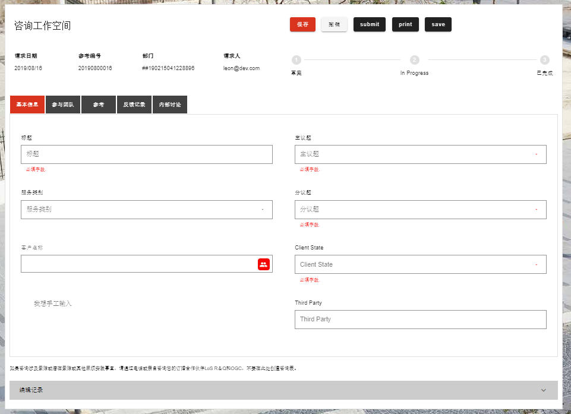

# 多语言设置

## 系统级

系统默认支持三种语言： 中文、英文和 繁体中文,可在application内多语言控件上切换


## application 级

因为application 上定义的form 和 page 结构样式都是不同的，application 级别也支持自定义form 或者page 的多语言翻译。

可以通过xxx 功能 进行 form / page 级别的 多语言设置，如下：


其中多语言的设置格式如下：

```json
{
        "view11":"咨询工作空间",        
        "CreateDate":"请求日期",
        "RN":"参考编号",
        "Los":"部门",
        "StaffName":"请求人",
        "Subject":"标题",
        "TypeOfServices":"服务类别",        
        "ClientName":"客户名称",
        "ClientPicker":"客户名称",
        "Topic":"主议题",
        "SubTopic":"分议题",
        "ClientStatusHidden":"客户状态",
        "ClientState":"我想手工输入",  
        "tabs-1":{
          "Basic_Information":"基本信息",
          "Consultation":"参考",
          "Engagement_Team":"参与团队",
          "Response_Discussion_History":"反馈记录",
          "Internal_Discussion":"内部讨论"
        }, 
        "C4-WorkflowState":{
          "Draft":"草案",
          "InProgress":"进行中",
          "Completed": "已完成"
          },
          "claim-text":"如果咨询涉及索赔或潜在索赔或其他麻烦实践事宜，请通过电话或亲自咨询您的订婚合作伙伴LoS R＆Q和OGC，不要在此处创建咨询表。",
          "footer":"中文的footer"
      }  
```


系统会自动识别设置，进行多语言翻译

